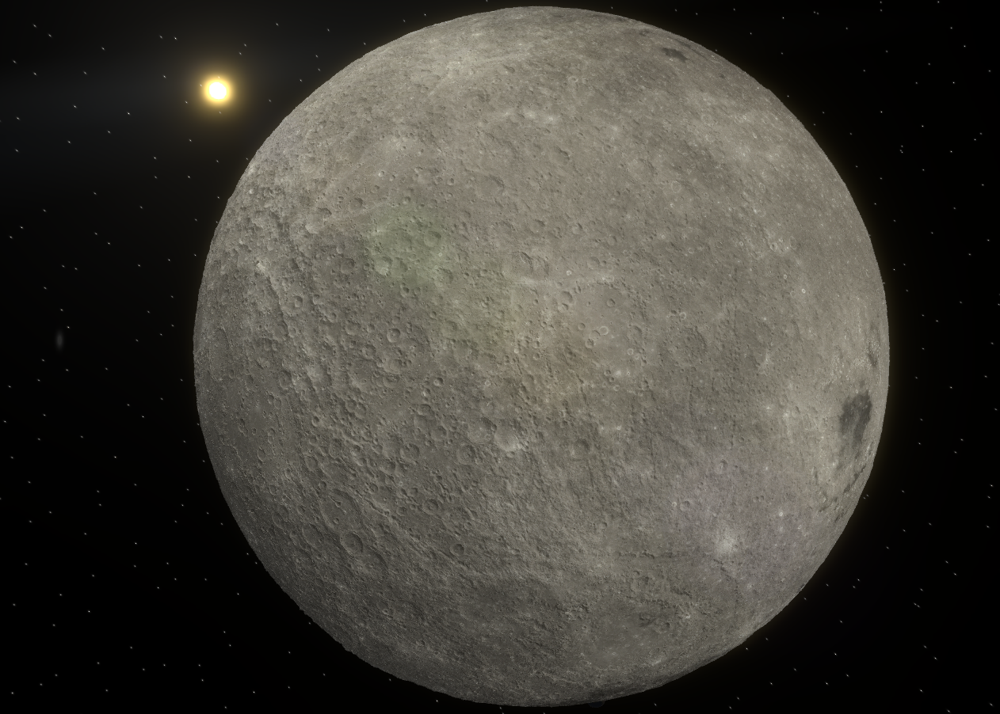
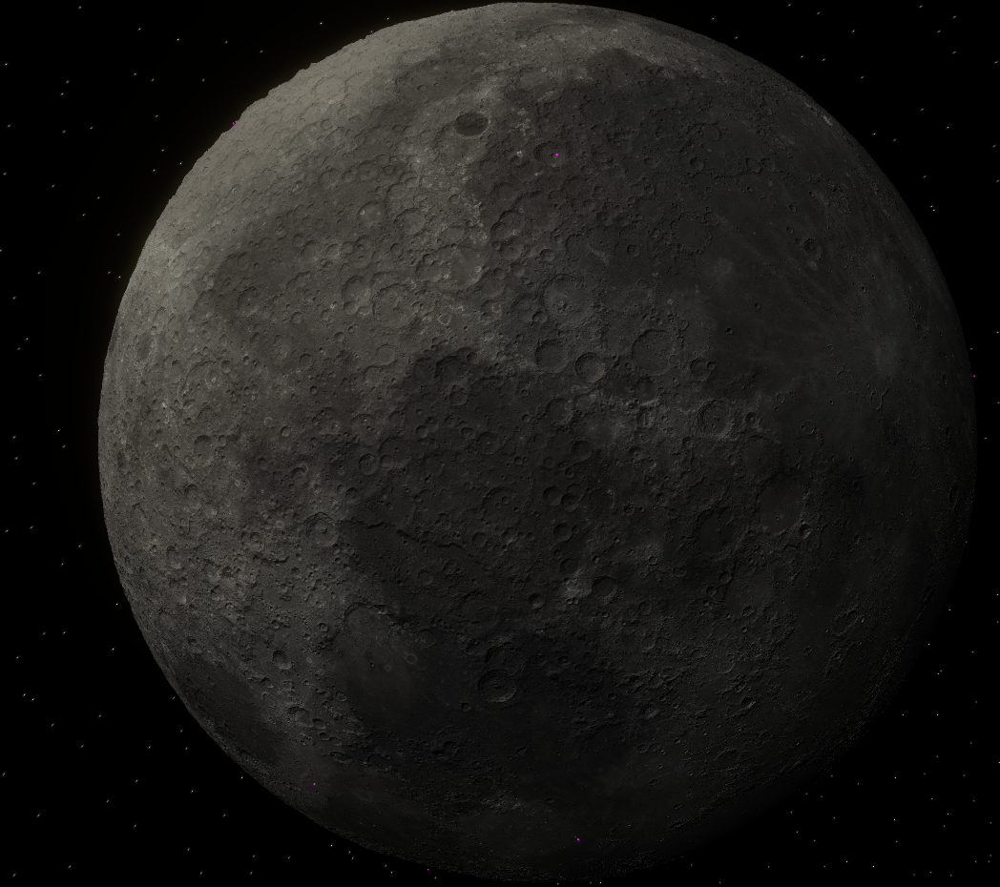
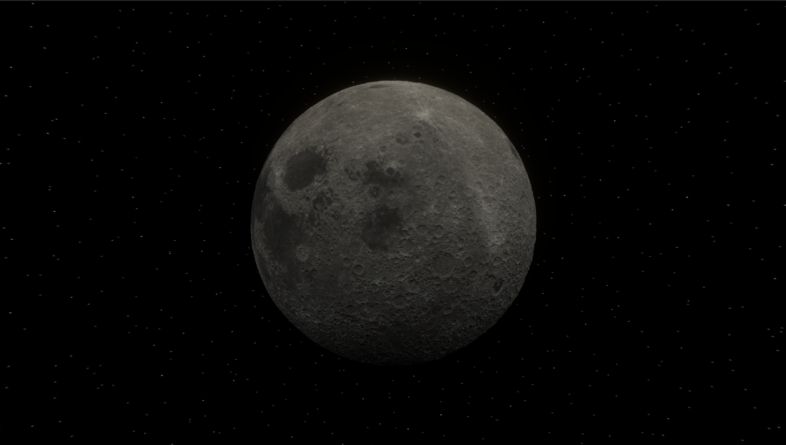

Team Solstice's submission for NASA's 2022-2023 App Development Challenge.  
# What Is This?
The 2022-2023 App Development Challenge centered around the simulation of a select few craters located around the moon, instructing teams to build up a 3D scene from the source data.  
This project does this and more - it not only can generate every crater, but also the entirety of the lunar terrain as well (albeit at a lower resolution). Although this project was created entirely from scratch, many of the same terrain generation concepts are shared between this project and my (Leo Wang) [internship with NASA](https://github.com/Andallfor/MVT). The primary difference is that there is an increase focused on visual fidelity as opposed to scientific rigor.
# Gallery
All photos are taken from within the project.  

  
  
[Link to our previous season's submission (under the name Equinox).](https://github.com/Andallfor/NASA-ADC-2020)